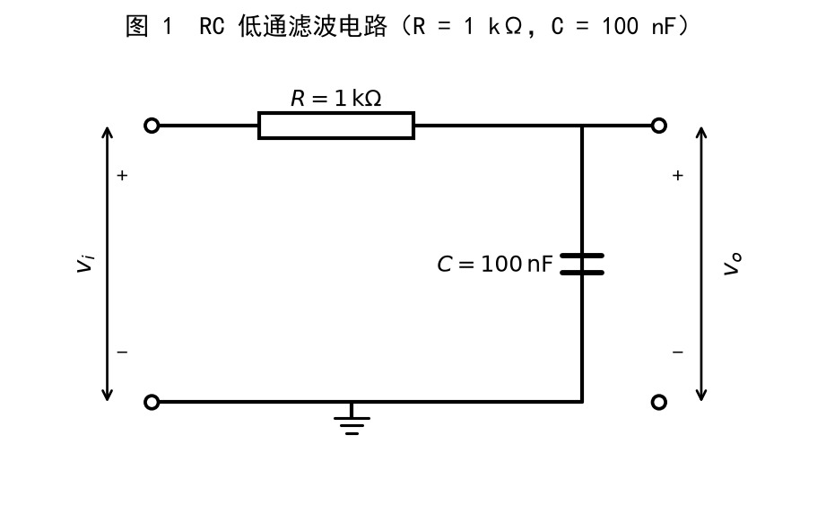
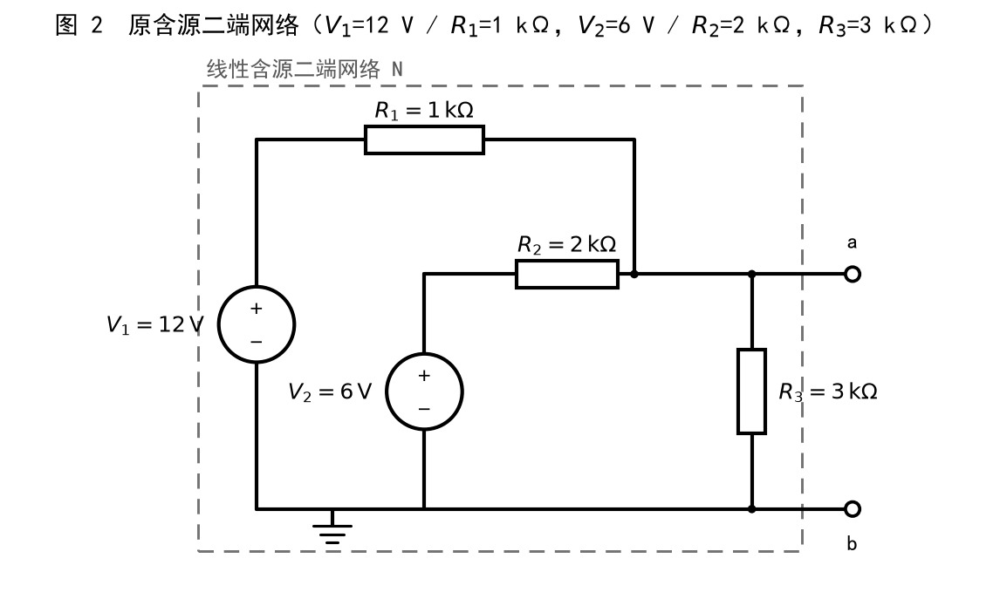
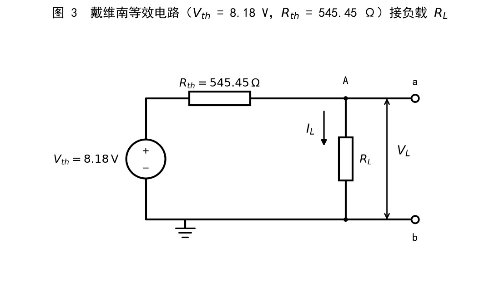
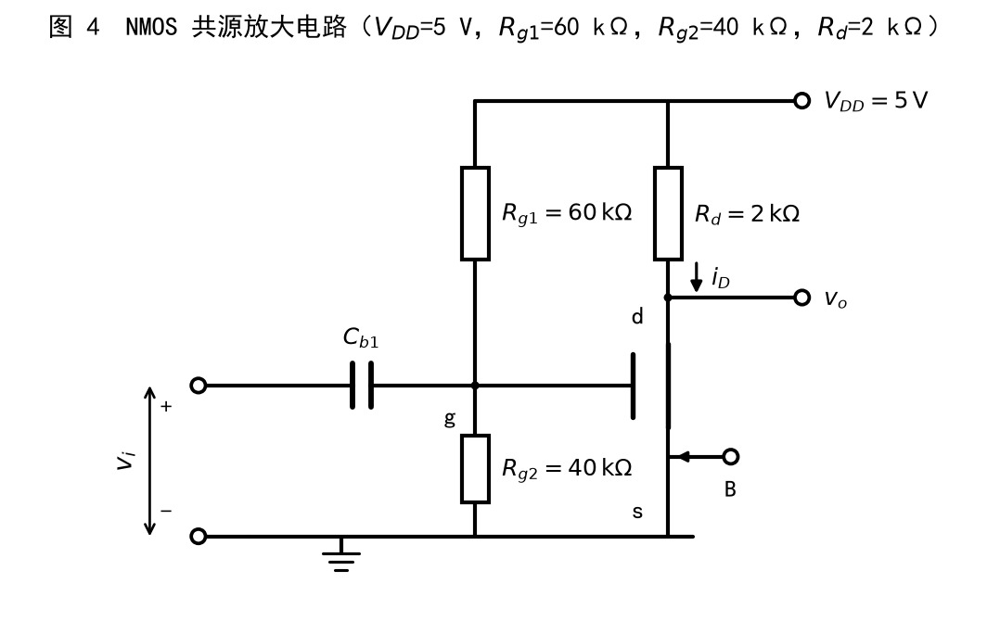
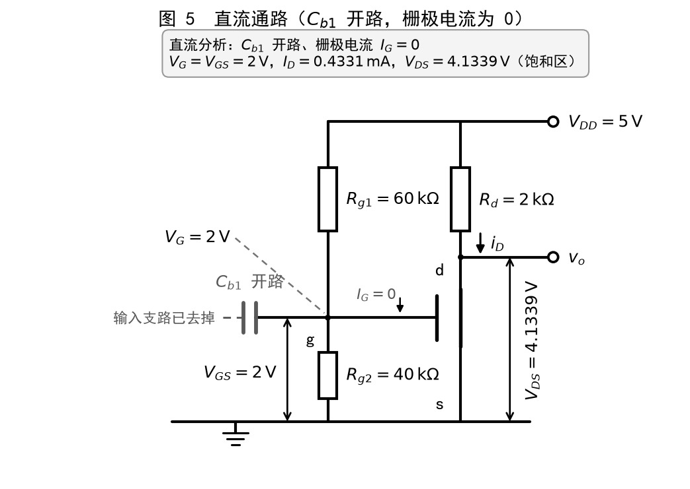
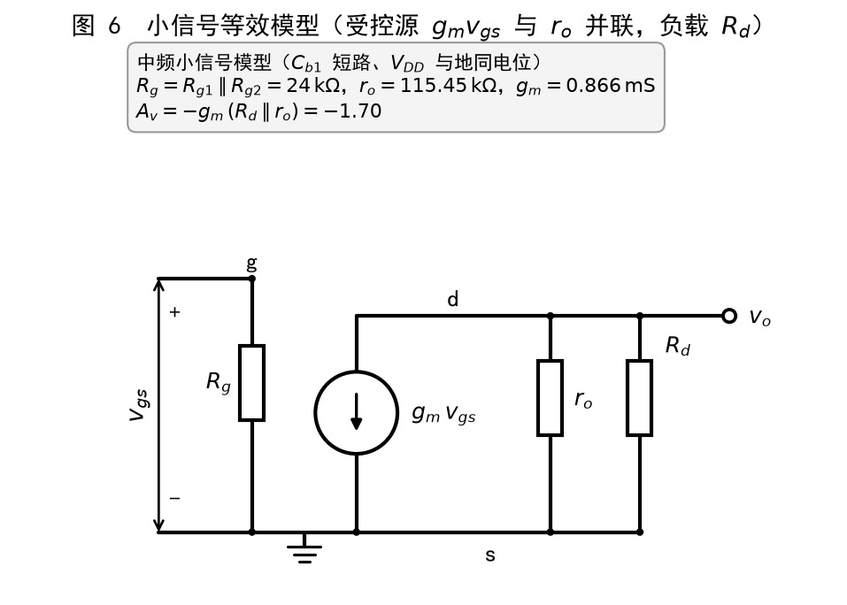
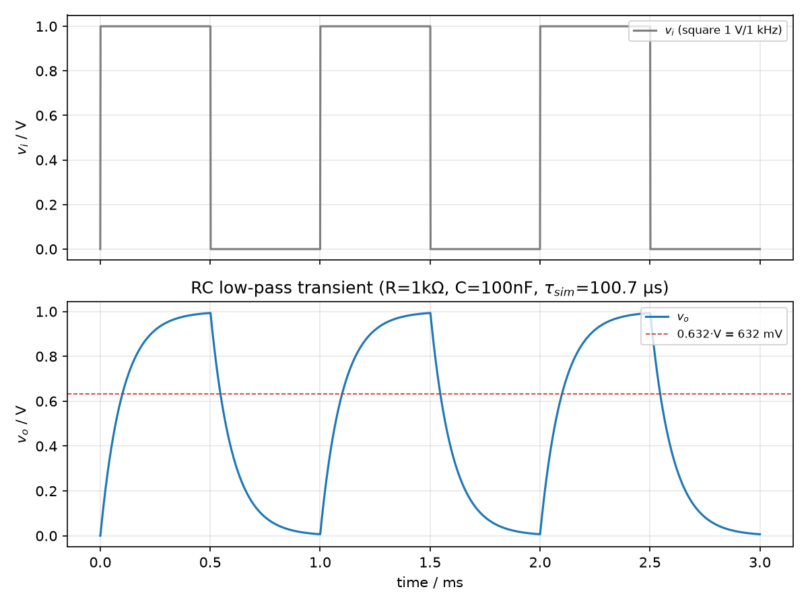
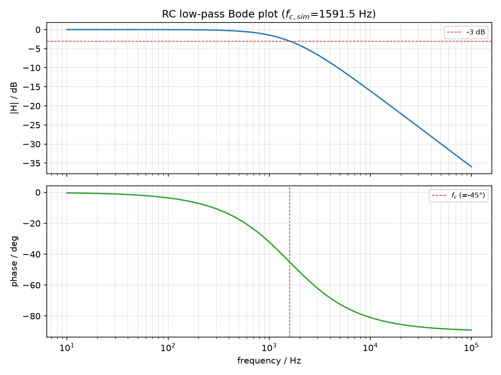
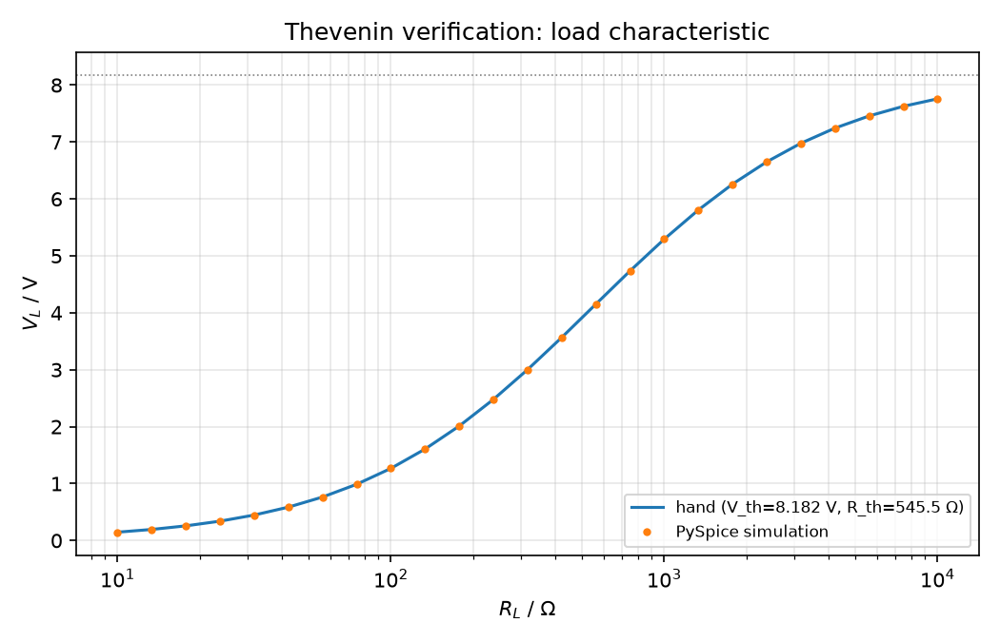
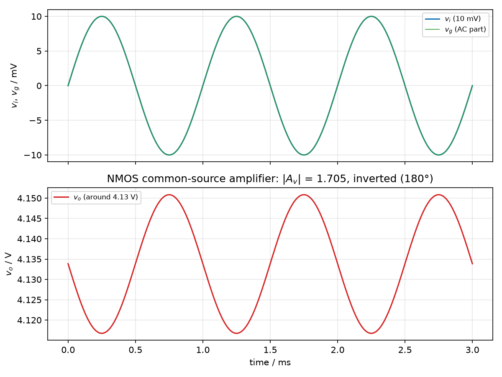

# 大一招新考核 · 黄耿桐

- **个人简介 PDF**：[`个人简介.pdf`](./个人简介.pdf)
- **个人网站**：https://yaccis.github.io/huang/
- **小游戏**：2048 · 在线试玩 https://yaccis.github.io/huang/2048_corner_balanced/ （源码在 `2048_corner_balanced/`）
- **进阶挑战（PySpice 电路仿真）**：源码在 `进阶挑战/`，完整报告见 [`进阶挑战/README.md`](./进阶挑战/README.md)
- **仓库地址**：https://github.com/yaccis/huang

> **AI 使用说明**：本项目全程使用 AI 编程工具辅助完成（任务书允许，品牌不限）。代码主要由 AI 生成，我负责提出需求、迭代提示词、调试和调整；本文档的文字整理也借助了 AI，但所有涉及代码逻辑的结论都由我本人读源码并实际运行验证过。

---

## 三、通用素养

### 1. Git 操作

本仓库共有 33 次提交，时间跨度 2026-09-07 至 2026-10-03，按「建仓库 → 个人主页 → 加入 2048 → 补文档」的顺序逐步完成，可在 [Commits](https://github.com/yaccis/huang/commits/main) 查看完整时间线。

- **分支**：从主线（main）拉出来的一条独立开发线，可以在不影响主线可用版本的前提下试验新功能。
- **合并**：把某条分支上的改动并回主线，形成一次完整的更新。若两边改了同一处，就需要手动解决冲突后再合并。

### 2. 命令行

| 命令 | 用途 |
|---|---|
| `cd <目录>` | 切换当前所在目录；`cd ..` 回到上一级 |
| `ls` | 列出当前目录下的文件 |
| `mkdir <名字>` | 新建文件夹 |
| `git status` | 查看哪些文件被改动过、有没有被暂存 |
| `git add <文件>` | 把改动放进暂存区，准备提交 |
| `git commit -m "说明"` | 把暂存区的改动提交成一个版本 |
| `git log` | 查看提交历史（本仓库的 12 次提交就是这样查的） |
| `git push` / `git pull` | 把本地提交推到 GitHub / 把远端更新拉到本地 |
| `git branch` / `git checkout` / `git merge` | 查看·新建分支 / 切换分支 / 合并分支 |

### 3. 信息与安全意识

#### 3.1 LICENSE

本项目使用 **MIT 许可证**，见 [LICENSE](./LICENSE)。

选择它的理由：MIT 是最宽松的开源许可证之一，允许他人自由使用、修改、分发甚至商用，**只要求保留版权声明**。这是一个个人学习作品，我希望别人能随意参考、复用其中的代码和思路，不需要附加额外限制；相比之下 GPL 会要求衍生作品也开源，对这个项目来说限制过强。

#### 3.2 两步验证

已在 GitHub 账号上开启两步验证，验证方式为**验证器 App（TOTP）**，恢复码已离线保存。

#### 3.3 一条「AI 给过但我查证后认为是错误的信息」

- **AI 说**：AI 给的 `finishAI()` 用一句话判断这局是赢是输 —— 消息里出现「2048」就算胜利，否则再看有没有「游戏结束」。
- **我为什么怀疑**：判断输赢靠「文案里有没有这几个字」，而不是一个明确的输赢状态，这种写法看着就不牢靠；那要是分数里刚好有 2048 呢？
- **我怎么查证的**：打开游戏按 F12 进控制台，把这句判断单独跑了一遍：`'第一局游戏结束！最终分数：12048'.includes('2048')`，返回 `true` —— 消息里含「2048」这四个字符就返回真。我又把它抄出来用不同分数逐个试：分数是 2048 / 12048 / 20480 时全被判成「胜利」，3560 / 16000 才正确判成「游戏结束」。
- **结论**：AI 写错了。AI 输掉的那一局，只要分数里恰好含「2048」（比如 2048、12048、20480），战绩列表就会把它记成「胜利」。根因是用字符串包含来反推状态，太脆弱；正确做法是让调用方直接把结果传进来，例如 `finishAI(text, '胜利')`，不要从文案里猜。

### 4. 防「纯粘贴」承诺

> **说明**：本节的文字整理借助了 AI 工具，但下面两处逻辑都是我逐条读源码验证过的 —— 「整行数字总和不守恒」是我把 `i++` 注释掉实测出来的结果，「空格项占总分 78%」是我写脚本算出来的，结论能当面复述。

#### 4.1 关键逻辑一：`processLine()` 里那个 `i++`

- **它要解决什么问题**：每次移动要把整行往一个方向挤，相邻相同的合并成两倍。规则要求每个方块一次移动只能合并一次，而且合并不能凭空造出数字 —— 整行的数字总和必须不变。
- **核心思路**：先把这一行的 0 去掉（`[0,2,0,2]` → `[2,2]`），再从左往右扫，遇到相邻相同就合并成两倍；合并完立刻 `i++`，**跳过已经被合并掉的那一格**，保证同一个方块在一次移动里只被用一次。最后补 0 补回 4 个。
- **关键变量 / 函数在干什么**：`filtered` 是去掉 0 之后的数字，`out` 是合并结果（全程只往里放新数字，不会再被扫到），`gained` 累加本次合并新产生的数字作为得分，而 `i++` 就是"被吃掉的格子不能再参与合并"这条规则的实现 —— 全函数最关键的一步。
- **如果我改动某个参数会怎样**：我把 `i++` 注释掉实测了一遍，整行数字总和不再守恒：`[2,2,4,0]` 本该是 `[4,4,0,0]`（和 8），实际变成 `[4,2,4,0]`（和 10）；`[4,4,4,4]` 本该是 `[8,8,0,0]`（和 16），变成 `[8,8,8,4]`（和 24）—— 凭空多出方块，游戏规则就崩了。原因就是**被吃掉的那一格在下一轮又被拿去合并了一次**。

另外，四个方向共用这一份逻辑：往右移时先把整行 `reverse()`，用同一套"向左"的算法处理，再 `reverse()` 回来。这样"最先合并的是靠墙那一对"才成立（`[2,0,2,2]` 往右移，该合并的是右边那一对）；不 reverse 直接处理，就会变成靠左的先合并，方向就反了。

#### 4.2 关键逻辑二：评分函数 `evaluate()` 是怎么想的

- **它要解决什么问题**：AI 本身不懂 2048，它只是每一步挑一个"当前局面分数最高"的走法。所以"什么局面算好"必须量化成分数 —— `evaluate()` 就是这张打分表，它写得好不好直接决定 AI 强不强。
- **核心思路**：把玩家玩 2048 的经验翻译成数字相加：① **空格数（×90000，权重最高）**，一切操作都靠空格，塞满就动不了 —— 我实测健康盘面里这一项占总分 **78%**，意思是"宁可少得分也要留空位保命"；② **蛇形权重（×260）**，一张 4×4 权重表沿蛇形路线递增，希望整盘数字从大到小排好队，排队才有连续合并的机会；③ **单调性（×700）**，一行一列要朝同一个方向递增或递减，乱序的数字会互相卡住；④ **平滑度（×120）**，相邻格子数值越接近越好，属于微调；⑤ **角落奖励（±2 万）**，最大块蹲右下角有重奖，因为角落只有两个邻居、不挡中间通道；⑥ **最大块（×3000）**，单纯奖励大数字，防止 AI 只求不死、迟迟不合大块。
- **关键变量 / 函数在干什么**：`evaluate()` 把几项加起来；`empties()` 数空格；`snakeScore()` 按蛇形表打分；`monotonic()` 和 `smooth()` 检查相邻关系；`cornerScore()` 判断最大块在不在角落。另外 `search()` 里对"刚走完这一步"还额外加一项 `mergeScore`（每个合并值取平方再相加），这是"立刻见效"的诱惑，和上面"局面好不好"是两个时间尺度。
- **如果我改动某个参数会怎样**：把空格项系数从 90000 改成 0，AI 会为了马上合并把棋盘填满、很快憋死；把最大块奖励去掉，AI 会畏首畏尾、迟迟不合出大数字；把合并奖励从平方改成线性，AI 就不愿意攒大招、只爱捡小便宜。

---

## 四、小游戏（2048 · 两阶段）

**阶段一 · 可玩版本**：键盘方向键 / WASD 操作，也支持手机滑动；规则完整，包含得分、最高分、胜负判定；界面实时显示当前分数与最高分。

**阶段二 · AI 自动演示**：点击「AI 开始演示」后，AI 自动操作直到合成 2048，全程无需人工干预。

**新增功能（在任务书可选清单中实现了 3 项）**：

1. **主题切换**：深色 / 浅色两套配色一键切换，选择结果写入 `localStorage`，刷新后保留。
2. **多局战绩记录**：自动记录最近 10 局的结果、分数、最大方块、步数与时间，新一局自动追加，可展开查看完整列表。
3. **计分制**：显示得分与历史最高分，最高分不随新一局清零。

### 怎么运行

1. **在线玩（推荐）**：直接访问 <https://yaccis.github.io/huang/2048_corner_balanced/>；页面上的「AI 开始演示」就是阶段二。
2. **本地玩**：下载仓库后双击 `2048_corner_balanced/index.html` 即可 —— 纯前端、无框架依赖，不用装任何环境，也不用起本地服务器。
3. **操作**：方向键或 WASD 移动（手机上直接滑动）；「新一局」重开一局，「重置」清空分数与战绩，右上角按钮一键切换主题。
4. **看战绩**：点开「战绩」可以展开最近 10 局的分数、最大方块、步数和时间。
5. **个人网站**：同样不需要环境，访问 <https://yaccis.github.io/huang/> 或双击根目录 `index.html`。

---

## 五、关键提示词与迭代过程

> 说明：下表按「我的需求 → AI 给了什么 → 我发现什么问题 / 怎么调整」记录每一次迭代。「我给的提示词」一列是我当时请求的要点（原话按要点压缩）。

### 阶段一：先做出自己能玩的版本

| 轮次 | 我给的提示词 | AI 的结果 | 我怎么调整 |
|---|---|---|---|
| 1 | 用纯前端 HTML/CSS/JS 做一个 2048，不要框架，键盘方向键操作，要有得分和胜负判断，界面干净。 | 一次给出可运行版本，但棋盘是固定像素尺寸，窗口变小会溢出。 | 追加「棋盘尺寸改用 CSS 变量、窄屏按视口等比缩放」，并要求拆成 `index.html` / `script.js` / `style.css` 三个文件，方便我逐段读懂。 |
| 2 | 逐行解释合并逻辑，并告诉我把 `processLine()` 里的 `i++` 注释掉会怎样。 | 讲清了「合并后要跳过下一格」，并演示注释掉后 `[2,2,4,0]` 会变成 `[4,2,4,0]`、整行数字总和不守恒。 | 让它把这条注释写进代码（「三、通用素养」4.1 节引用的就是这段），并自己实测核对了一遍。 |
| 3 | 再加三个功能：① 计分制（得分/最高分/局数，新一局不清零，带「重置」按钮）② 主题切换（≥2 套配色，一键切换，刷新后保留）③ 最近 10 局战绩记录（新一局自动追加，可查看完整列表）。 | 三个功能都实现了，但主题只改了一部分颜色，刷新后回到默认配色。 | 追加「所有颜色都走 CSS 变量，选中的主题写进 `localStorage`，页面加载时读回来」，并让它列出所有还在写死颜色的地方。 |

### 阶段二：让 AI 自动演示

| 轮次 | 我给的提示词 | AI 的结果 | 我怎么调整 |
|---|---|---|---|
| 1 | 写一个自动演示模式：AI 自己判断往哪个方向走，目标合出 1024，全程不用人操作。 | 第一版是贪心：只看「哪边能让最大数字靠角落」，十几步就把棋盘堵死。 | 追问「为什么几步就死了」，它承认只看了一步、没考虑空格和后续空间；于是改成给每个候选方向打分再选最高的。 |
| 2 | 帮我设计评分函数，要考虑空格数量、最大块在角落、单调性、平滑度。 | 给出 `evaluate()`：空格 ×90000、蛇形权重 ×260、单调 ×700、平滑 ×120、角落奖励、最大块 ×3000。 | 让它把每一项的得分和占比打印出来验证（`verify-evaluate.mjs` 就是干这个的），实测空格一项约占总分 78%，确认「保空格优先」是主要策略。 |
| 3 | 自动演示跑着跑着显示「胜利」，但棋盘上根本没有 2048，查一下为什么。 | 定位到 `finishAI()` 用 `String(board).includes('2048')` 判胜负，12048、20480 这种格子也会命中。 | 改成遍历格子做数值比较（`cell === 2048`）；这条同时写进了「三、通用素养 3.3」的 AI 错误案例。 |

### 进阶挑战：PySpice 三个电路（任务书第五项）

| 轮次 | 我给的提示词 | AI 的结果 | 我怎么调整 |
|---|---|---|---|
| 1 | 用 PySpice 写 NMOS 共源放大电路的仿真：VDD=5V、Rg1=60kΩ、Rg2=40kΩ、Rd=2kΩ、K=0.8mA/V²、Vth=1V、λ=0.02/V，输入 10mV/1kHz，打印静态工作点和小信号增益。 | 电路能建起来，但漏了沟道长度调制 λ，I_D 按 0.4mA 算，和仿真对不上；模型名当位置参数还报了 `NameError: Number of args mismatch`。 | 让它把 λ 算进 I_D（联立 V_DS = V_DD − I_D·R_d 解方程），模型名改成关键字 `model='nmos1'`；改完手算 0.4331mA 与仿真完全一致。 |
| 2 | 再加一个 RC 低通和一个验证戴维南定理的脚本，都要打印「手算 vs 仿真」对比表。 | 网表和对比表都对，但短路电流那一步自己调了 `save()`，导致读不到电压源支路电流。 | 去掉 `save()`（PySpice 不生成 `.save` 指令时，ngspice 才默认保存全部节点电压和电压源支路电流），短路电流改用 0V 电压源当电流表读。 |
| 3 | 脚本总报节点名相关的警告怎么办？ | 指出 `in` 是 Python 关键字，PySpice 会报警告。 | 把节点 `in` / `out` 改成 `vin` / `vout`。 |
| 4 | 报 `NameError: Cannot locate binary data`，帮我把 ngspice 在 Windows 上跑通。 | 先让改 `spinit` 的 `set filetype`，又让往网表里注入 `.control` 块，再让设 `SPICE_LIB_DIR`；每次都只修好其中一个报错又冒出新报错。 | 把每次 ngspice 的输出都存下来逐字节对比，最后确认命令行模式在 Windows 上无解，改用共享库模式（`ngspice.dll`），并让脚本自动搜 dll、自动选模式。 |
| 5 | 瞬态仿真测出来的 τ 只有 32µs，理论值是 100µs，哪里错了？ | 说明「0.5V 穿越到 0.632V 的时间差」只有 0.307τ，不是 τ。 | 改成在 10%~90% 上升段每个采样点上算 −t/ln(1−v/V_high) 再取平均，实测 100.7µs，误差 0.7%。 |

---

## 六、踩过的坑

1. **AI 自动演示把「没到 2048」判成了胜利**
   - 现象：自动演示只合到 1024 就显示「胜利」。
   - 原因：胜负判断写成了 `String(board).includes('2048')`，字符串包含判断让 12048、20480 也命中。
   - 解决：改成遍历格子做数值比较（`cell === 2048`），每局结束把棋盘打印出来核对。
2. **贪心的自动演示几步就把棋盘堵死**
   - 现象：开局还行，十几步后没有合法方向可走。
   - 原因：只按「最大数字所在方向」走，等于只看一步，不考虑空格和后续空间。
   - 解决：换成 `evaluate()` 加权打分选方向，并写 `verify-evaluate.mjs` 把各项得分占比算出来验证权重。
3. **PySpice 在 Windows 上调不动 ngspice（`Cannot locate binary data`）**
   - 现象：装好 ngspice 后 `operating_point()` 报 `NameError: Cannot locate binary data`；往网表里注入 `set filetype=binary` 后又变成 `NameError: Expected label Circuit instead of Note`。
   - 原因：PySpice 默认走 `ngspice -s` 命令行服务器模式，而 ngspice 自带的 `spinit` 写着 `set filetype=ascii`（raw 文件变成纯文本），启动输出开头又多一行 `Note: ...`，两头都跟 PySpice 的解析器对不上。
   - 解决：改用共享库模式（`simulator='ngspice-shared'` + `ngspice.dll`，同时设 `NGSPICE_LIBRARY_PATH` 和 `SPICE_LIB_DIR`），并把「自动找 dll、自动选模式」写进三个脚本。完整过程见 `进阶挑战/README.md` 的 7.6 节。
4. **MOS 源极忘了接地，仿真结果离谱**
   - 现象：直流通路仿真给出 V_GS = −3.01V、I_D ≈ 0，手算却是 2V / 0.4331mA。
   - 原因：网表写成 `M1 d g s s nmos1`，节点 `s` 只连了晶体管端子、没有到地的直流通路，ngspice 靠结漏电勉强收敛到一个假解。
   - 解决：源极直接接地，误差立刻变成 0.00%。教训是 —— 误差大时先查拓扑，别急着怀疑参数。
5. **瞬态法测 τ 用错了公式**
   - 现象：RC 电路仿真测出 τ = 32µs，理论值 100µs。
   - 原因：把「0.5V 到 0.632V 的穿越时间差」当成了 τ，而这一段只有 0.307τ。
   - 解决：对上升段每个采样点算 −t/ln(1−v/V_high) 取平均，得到 100.7µs。
6. **matplotlib 画图时中文和下标渲染成方框**
   - 现象：图上中文缺字、下标和减号显示成小方框，并刷出一堆 `Glyph missing from font(s) SimHei` 警告。
   - 原因：SimHei 字体里没有下标字符（U+2081–2083）和 U+2212 减号。
   - 解决：中文用 SimHei，标题里的公式和下标改用 mathtext（`$V_1$`），负号用 ASCII `-`，警告清零。

---

## 七、进阶挑战（PySpice 电路仿真 · 任务书第五项）

> 任务书第五项的两个任务，我选做**任务一：用 PySpice 完成三个电路**（RC 滤波电路、验证戴维南定理、NMOS 共源放大电路）。

**做了什么**：三个电路各一份 Python 脚本，每份都包含「纯手算函数 + 电路搭建 + 仿真」三部分，运行后直接打印「理论值 vs 仿真值」对比表，并输出波形数据（CSV）与图（PNG）。三个脚本共用同一套「自动找 ngspice、自动选运行模式」的逻辑。

| 文件 | 内容 |
|---|---|
| `进阶挑战/rc_lowpass.py` | RC 低通：1kHz 方波瞬态 + 10Hz–100kHz 交流扫描，自动测 τ、稳态值、f_c，输出波特图 |
| `进阶挑战/thevenin.py` | 戴维南定理：分别仿真「测开路电压」「测短路电流」，再用等效电路替换原网络接三种负载，三者互相对比 |
| `进阶挑战/mos_common_source.py` | NMOS 共源放大：直流工作点、饱和区判断、`gm` / `ro` / `Av` 手算，瞬态看反相放大波形 |
| `进阶挑战/draw_figures.py` | 用 matplotlib 画 6 张电路图（原理图、直流通路、小信号等效模型） |
| `进阶挑战/README.md` | 完整报告：手算公式与推导、全部对比表、画图清单、环境准备与踩坑记录 |

**结果（手算 vs 仿真，全部为实机实测）**：

| 电路 | 量 | 手算 | 仿真 | 误差 |
|---|---|---|---|---|
| RC 低通 | 时间常数 τ | 100.0 µs | 100.7 µs | 0.70% |
| RC 低通 | 截止频率 f_c | 1591.55 Hz | 1591.48 Hz | 0.00% |
| RC 低通 | 5τ 时输出 | 0.9933 V | 0.9932 V | 0.01% |
| 戴维南 | 开路电压 V_oc | 8.1818 V | 8.1818 V | 0.00% |
| 戴维南 | 短路电流 I_sc | 15.0000 mA | 15.0000 mA | 0.00% |
| 戴维南 | 等效电阻 R_th | 545.45 Ω | 545.45 Ω | 0.00% |
| MOS 共源 | 静态工作点 V_GS / I_D / V_DS | 2.0000 V / 0.4331 mA / 4.1339 V | 同左 | 0.00% |
| MOS 共源 | 小信号增益 \|A_v\| | 1.7028 | 1.7050 | 0.13% |

**怎么运行**（详细步骤见 `进阶挑战/README.md` 的 7.1 节）：

1. 装 Python 3.10+，然后 `pip install PySpice numpy matplotlib cffi`；
2. 准备 ngspice 运行库（Windows 用 conda-forge 的 `ngspice-lib` 包，取其中的 `ngspice.dll`），放到 `进阶挑战/ngspice/Spice64/Library/bin/` 或 `D:\ngspice\...`；
3. 运行 `python rc_lowpass.py` / `python thevenin.py` / `python mos_common_source.py`，脚本会自动找到 dll 并切到共享库模式，终端打印对比表，图与 CSV 存到 `进阶挑战/figures/`；
4. 想重新生成电路图就运行 `python draw_figures.py`。

**电路图**（自己画的，用 matplotlib 按标准符号绘制）：

**仿真输出**：

---

## 八、AI 生成与实际调整的说明

| 部分 | 由 AI 生成 | 我做的调整 / 验证 |
|---|---|---|
| `2048_corner_balanced/` | 初版框架、合并逻辑、判定逻辑、AI 打分函数 | 把判胜负从 `includes('2048')` 改成逐格数值比较；主题颜色全部改走 CSS 变量并写入 `localStorage`；拆成三个文件；用 `verify-evaluate.mjs` 核对打分权重 |
| 个人网站 | 页面结构、样式初版 | 文案与链接、配色和布局调整 |
| `进阶挑战/*.py` | 三个仿真脚本与绘图脚本 | 补上沟道长度调制 λ、修正 MOS 源极接地、修正 τ 的测量方法、模型名改关键字写法、改用 ngspice 共享库模式并加自动探测；本文档里的数值都是脚本实跑结果，不是推算 |

> 一句话总结：AI 负责写，我负责提需求、挑毛病、跑起来验证 ——「三、通用素养 3.3」和「六、踩过的坑」记的就是我把它挑出来的几个错。
